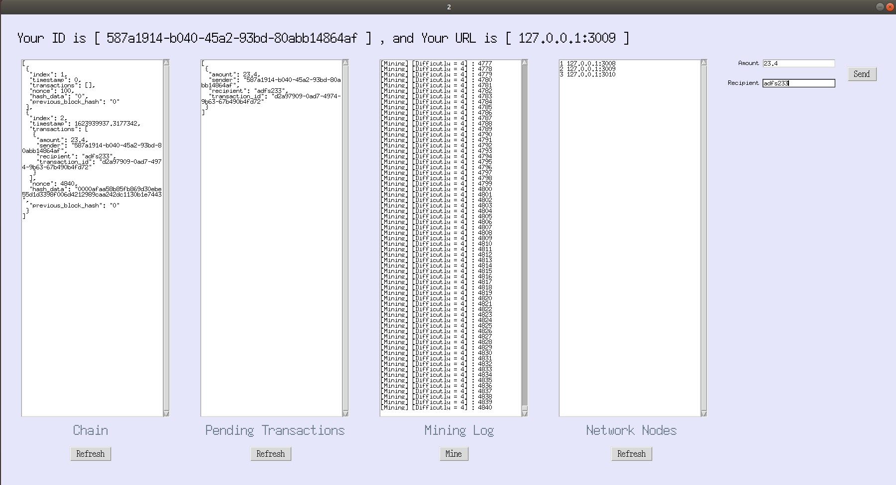

# 소켓 통신 기반의 블록체인 구현
## TCP/IP 기말 레포트
### 3-A 201944021 김민지
---
 

#### 1. 개요 및 목적
- 멀티 쓰레드에 대한 이용과 사용 방법 숙지
- 서버-클라이언트 구조와 대조되는 p2p 구조에 대한 이해

#### 2. 설계 및 기능
(1) p2p_server.py
- 중심 서버 가동
- 쓰레드로 클라이언트(노드) 접속 대기
- 접속한 클라이언트 정보를 받아 연결된 모든 클라이언트들에게 전달
(2) p2p_network_node.py
- 중심 서버로부터 받은 다른 노드들의 정보를 리스트로 입력
- 새로운 서버 소켓을 만들고 해당 정보를 중심 서버로 전달
- 만들어진 서버 소켓과 쓰레드를 이용하여 다른 노드들로부터의 정보를 받고 gui에 출력
(3) blockchain.py
- 블록체인 모듈
- 실제 블록체인 모델보다 간소화되어, 합의 알고리즘이나 유효성 검사 과정은 포함되어 있지 않음
 

#### 3. 실행 화면
(1) p2p_server.py 최초 실행  

  
(2) p2p_network_node.py 실행-node1  

 

  
(3) p2p_network_node.py 실행-node2  

  
(4) p2p_network_node.py 실행-node3까지 실행 시 모든 콘솔 결과  

  
(5) gui에서 chain, network nodes 아래의 refresh 버튼 클릭 (node1, 2, 3) 
 
 
 
  
(6) node1에서 transaction 발생 (node1, 2, 3 동일 트랜잭션 추가) 
 
 
 
  
(7) node2에서 mining 발생 (node1, 2, 3 동일 블록 추가) 
 
 
 
  
#### 4. 참고 자료
- 자바스크립트와 함꼐하는 블록체인 코딩(Eric Traub, 홍릉과학출판사)
- TCP/IP 프로그래밍 교안
 

#### 5. 구현 및 실행 환경
- Ubuntu LTS 18.04
- Python 3.8.8
